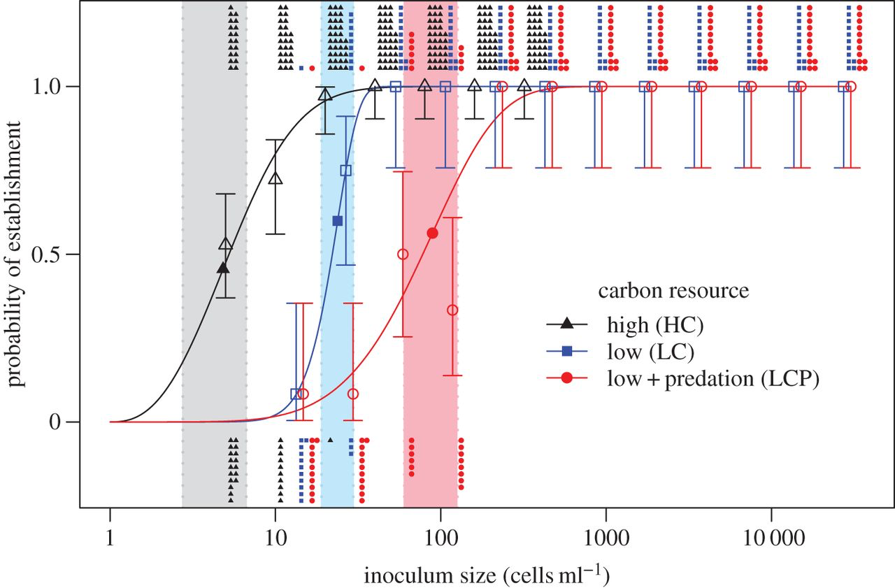
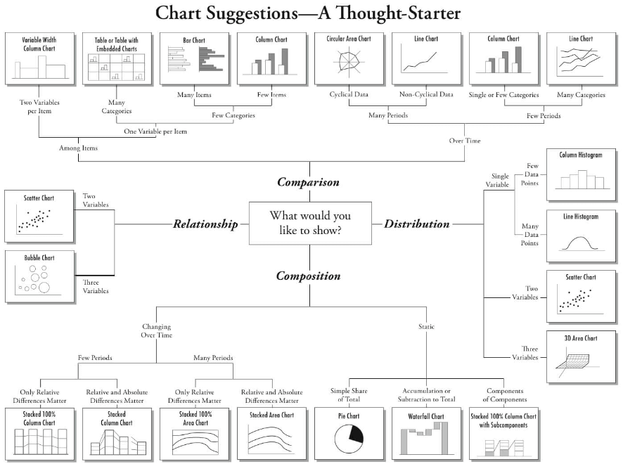

```{r setup, include=FALSE}

knitr::opts_chunk$set(echo = TRUE, eval=FALSE, warning = FALSE, message = FALSE)

```

#<span style="color:cadetblue">Data Vizualizations</span>

***

This module will cover: 

  - plotting in base R
  - plotting in ggplot
  
which will require the following skills already covered:

  - reading in data
  - manipulating data  
  - assigning an object

We will also touch on choosing an appropriate visualization, interactive graphics, and maps. 

## <span style="color:cadetblue">Introduction</span>

Data visualization in `R` can be quick and dirty (ie. data exploration for yourself) or highly polished (ie. communicating to others). We have already touched on quick data exploration in the third module yesterday. Today we will cover content to produce a more polished looking plot. 

## <span style="color:orangered">Two approaches to the same problem: Base `R` vs `ggplot`</span>

Plotting in base `R` can allow the user to create highly customized plots. This customization takes time, and requires many decisions. An alternative is to use the package `ggplot2` developed by Hadley Wickham based on the [*Grammer of Graphics*](http://www.springer.com/us/book/9780387245447) written by Leland Wilkinson. `ggplot2` has its own unique syntax that is a bit different from base `R`. I will walk through an example using base `R` and then recreate the figure using `ggplot2`. For even more side-by-side examples, see Nathan Yau's blog post on [Flowing Data](https://flowingdata.com/2016/03/22/comparing-ggplot2-and-r-base-graphics/). 

### <span style="color:cadetblue">Base</span> `R`

A simple plot can take many more lines of code than you expect based on the visualization. When plotting in base `R` you'll use a handful of parameter settings in either `par()` or in the plotting related functions listed below. 

#### Important parameters ###
* **pch**: plotting symbol
* **lty**: line type
* **lwd**: line width
* **col**: plotting color
* **las**: orientation of axis labels 
* **bg**: background color
* **mar**: margin size
* **oma**: outer margin size
* **mfrow**: number of plots per row, column. Plots filled in row-wise.
* **mfcol**: number of plots per row, column. Plots filled in column-wise.

#### Important functions ###
* **plot**: make scatterplot
* **lines**: add lines to plot
* **points**: add points to plot
* **text**: add text
* **title**: add title to axes or plot
* **mtext**: add margin text
* **axis**: add axis tick/labels

Let's create a plot of the total population by county area for 5 midwest states (example taken from Selva Prabhakaran's [tutorial](http://r-statistics.co/Top50-Ggplot2-Visualizations-MasterList-R-Code.html#Scatterplot_)). This data is part of the `ggplot2` package. I start with the basic scatterplot function `plot()` and then customize from there.  
 
```{r base R, eval=TRUE}
library(ggplot2) #load the package with the data
data("midwest", package = "ggplot2") #load the data, midwest is now in the working environment. 
plot(y=log10(midwest$poptotal), x=midwest$area, #call the x and y values 
     col=as.factor(midwest$state), #point colors should be based on state 
     pch=19, cex=.75,#point shape and size
     ylim=c(3,7), xlim=c(0,.1), #set the axis limites
     las=1, #rotate the axis labels 
     xlab="Area", ylab=expression('Log'[10]*'(Total population)'),#label the axis
     main ="Area vs population"#add a title
     )

```

#### <span style="color:cadetblue">Legends and more</span> 

This is where the true power of plotting with base `R` customization shows. You can change the axis ticks and lables, add text anywhere, and even create multiple figures in a single visualization. The most common addition to any visualization will be the legend since they are not automatically created when plotting with base `R`. You have to add them manually. There are a few different methods to do this, but the function `legend()` works in most cases. To add the legend to the plot above, run the `legend()` function following the `plot()` function. 

```{r legend}
legend("topright", col=c(1:5), pch=19,legend=levels(as.factor(midwest$state)))
```

The visualization would then look like this: 

```{r legend added, eval=TRUE, echo=FALSE}
plot(y=log10(midwest$poptotal), x=midwest$area, #call the x and y values 
     col=as.factor(midwest$state), #point colors should be based on state 
     pch=19, cex=.75,#point shape and size
     ylim=c(3,7), xlim=c(0,.1), #set the axis limites
     las=1, #rotate the axis labels 
     xlab="Area", ylab=expression('Log'[10]*'(Total population)'),#label the axis
     main ="Area vs population"#add a title
     )
legend("topright", col=c(1:5), pch=19,legend=levels(as.factor(midwest$state)))
```

#### <span style="color:cadetblue">A quick note on multipanel plots</span> 

A grid of plots in base `R` can be created using parameter setting mfrow or cfrow. Base `R` also gives you the option to make inset or subplots like this example here where the boxplot is inside the histogram. 

```{r inset plot, eval=TRUE}
x <- rnorm(100,sd=0.5)  #generate random data to plot
y <- rbinom(100, 1, 0.5) #generate random data to plot
par(fig = c(0,1,0,1)) #set dimensions of histogram figure from bottom, left, top, and right

hist(x)  #plot main figure

par(fig = c(0.07,0.35, 0.5, 1), new = T) #set dimensions of inset plot  
boxplot(x ~ y) #plot inset

```

The `layout()` function allows the user to create multipanel plots of different sizes, like this: 

```{r layout plot, eval=TRUE}
# One figure in row 1 and two figures in row 2
# row 1 is 1/3 the height of row 2
# column 2 is 1/4 the width of the column 1 
attach(mtcars)
layout(matrix(c(1,1,2,3), 2, 2, byrow = TRUE), 
  	widths=c(3,1), heights=c(1,2))
hist(wt)
hist(mpg)
hist(disp)

```


Here is an example of figure that Reni made using base `R` that has lots of information layered into a single visualization. 

```{r, eval=TRUE, out.width = "600px", echo=FALSE, fig.align='center'}

```

If you're interested in other customizations in base `R` check out Paul Murrell's [R Graphics](https://www.stat.auckland.ac.nz/~paul/RG2e/) book. 

###<span style="color:cadetblue">ggplot</span> 

 The same exact scatterplot of county area vs populations size can be made using `ggplot`. Here the legend is automatically created. Check out the source of the example, which also has a compiled list of 50 different visualizations along with the code [here](http://r-statistics.co/Top50-Ggplot2-Visualizations-MasterList-R-Code.html#Scatterplot). 

For more detailed examples, check out the [R Graphics Cookbook](http://www.cookbook-r.com/Graphs/index.html) by Winston Chang.

```{r ggplot, eval=TRUE}

# install.packages("ggplot2")
# load package and data
library(ggplot2)
theme_set(theme_bw())  # pre-set the bw theme.
# midwest <- read.csv("http://goo.gl/G1K41K")  # bkup data source

# Scatterplot
gg <- ggplot(midwest, #data, every arguement after this is connected with a '+' instead of a ','
             aes(x=area, y=log10(poptotal))) + #set the x and y col in data 
            geom_point(aes(col=state)) + #put a point at the (x,y) value, color it by state col
            xlim(c(0, 0.1)) + #set x axis limits
            labs( #name the different parts of the plot 
              subtitle="Area Vs Population", 
              y="Population", 
              x="Area", 
              title="Scatterplot", 
              caption = "Source: midwest") 

plot(gg) #plot the object
```

#### <span style="color:cadetblue">plotly</span>: easy interactive plots with ggplot

The `plotly` package is an add on to `ggplot2` for quick interactive plots. The package is still relatively new and is under current development. The legends or other features are often poorly displayed but the interactive feature maybe useful for data exploration during an inperson meeting. 

Below is an example from the `plotly` [website](https://plot.ly/r/line-and-scatter/). You'll notice the syntax is similar to `ggplots` but the functions have changed a bit. 

```{r plotly example, eval=TRUE}
library(plotly)

p <- plot_ly(data = iris, x = ~Sepal.Length, y = ~Petal.Length,
        marker = list(size = 10, color = 'rgba(255, 182, 193, .9)', line = list(color = 'rgba(152, 0, 0, .8)', width = 2))) %>%
  layout(title = 'Styled Scatter', yaxis = list(zeroline = FALSE), xaxis = list(zeroline = FALSE))

p #plot the interactive graphic
```

```{r plotly 3D, eval=TRUE}
plot_ly(z = volcano, type = "surface") #simple example of 3D surface plot
```

The `googleVis` package also has some great plots with tooltips built in.  

## <span style="color:cadetblue">Animated plots</span>

The `plotly` package also allows for quick animations like this. [Shiny](https://shiny.rstudio.com/) is an easy introductory tool to more novel data visualizations.


```{r plotly animation, eval=FALSE}
suppressMessages(library(gganimate))
birth<-read.csv("birth.csv", sep='', header=TRUE)

pal <- c("#313695","#4575b4","#74add1","#abd9e9","#e0f3f8","#ffffbf","#fee090","#fdae61","#f46d43","#d73027","#a50026")
vals <- seq(10,32, length = 11)
birth <- ggplot(birth, aes(x = Year, y = BirthRate, frame = Year, cumulative = TRUE)) +
  geom_line(colour="black") +
  geom_point(shape = 21, colour="black", aes(fill=BirthRate), size=5, stroke=1) +
  scale_x_continuous(limits=c(1880,2015)) +
  scale_y_continuous(limits=c(10,32)) +
  theme_minimal() +
  scale_fill_gradientn(colors = pal, values = vals, rescaler = function(x, ...) x, oob = identity, guide=FALSE) +
  xlab("Year") +
  ylab("Birth rate") 
p<-gganimate(birth, "birth.gif", ani.width = 750, ani.height = 500, interval = 0.1)
```


&nbsp;


## <span style="color:cadetblue">Graphic for communication</span>

There are plenty of guides on how to create the "best" visualization. This diagram is a good place to start when choosing your data visualizations. 





If you're plotting data to communicate (which is normally the case), some things you should keep in mind:

  - every addition plot feature is adding additional information
  - color choice (connotation, color blind)
  - how the audience expects to see data

For more details see <i>Ten guidelines for effective data visualization in scientific publications</i> by [Kelleher and Wagener, 2011](https://doi.org/10.1016/j.envsoft.2010.12.006). At some point during your graduate career, you'll likely hear about [Edward Tufte's](https://www.edwardtufte.com/tufte/) philosophy.   


## <span style="color:cadetblue">Spatial data</span>
 Just like other data vizualizations, mapping in `R` can be done a few different ways. Common packages include: 

  -  `maps`
  - `rMaps`
  - `mapdata` 
  - `ggmap`
  - `choroplethr`
  - `raster`
  - `sp`
  - `rgdal`

The last 3 (`raster`, `sp`, and `rgdal`) are also useful for analyzing spatial data. 

The `choroplethr` package is useful for plotting U.S. county level data like this:

```{r texas, eval=TRUE}
#install.packages("choroplethr")
#install.packages("choroplethrMaps")
#install.packages("mapproj")
library(ggplot2)
library(choroplethr)
library(choroplethrMaps)
library(mapproj)

data(df_county_demographics)
df_county_demographics$value = df_county_demographics$percent_hispanic
county_choropleth(df_county_demographics, 
                  state_zoom = "texas",
                  title      = "Texas County Percent Hispanic 2012 Estimates",
                  num_colors = 9) + coord_map()


```


Newer packages like `googleVis` also have built-in interactive features. 

```{r,results='asis', eval=TRUE}
suppressMessages(library(googleVis))
require(datasets)
states <- data.frame(state.name, state.x77)
GeoStates <- gvisGeoChart(states, "state.name", "Population",
                          options=list(region="US", 
                                       displayMode="regions", 
                                       resolution="provinces",
                                       width=600, height=400))
print(GeoStates,'chart')
```
