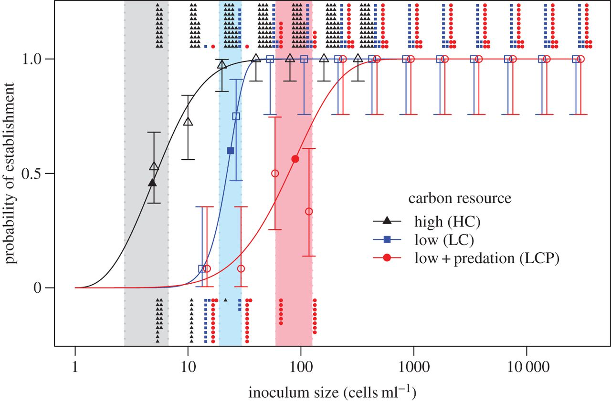

#<span style="color:cadetblue">1. Data types</span>

***

This module will cover: 

  - assigning objects
  - data structure and syntax
  - troubleshooting through Rstudio
  - data subsetting
  
```{r settings, echo=FALSE}
knitr::opts_chunk$set(echo = TRUE, eval=FALSE, fig.align = "center", warning = FALSE, message = FALSE)
```


##<span style="color:cadetblue"> `R` Objects </span>

Everything in `R` is an object. But what does this mean to someone who doesn't have a computer science background? 

`R` doesn't let users directly access the computer's memory, instead users access many different specialized data structures. You can think of this design as a filing cabinet. One drawer contains textbooks, another pictures, another data tables, and so on. In this analogy, each drawer is a different object class. 

If we look in the textbook drawer, each book or object has a similar structure (front cover, title page, table of contents, etc.). Just like each book has a unique title, `R` objects have user assigned names. 

Objects in `R` are often assigned a name by using an <span style="color:orangered">**arrow**</span> made from a the <span style="color:orangered">**less than**</span> sign and <span style="color:orangered">**dash**</span> <-

```{r make an object}
myname <- "Odum" #this line assigns "Odum" to an object 'myname'
myname #print the content of 'myname' object by running it in the console
```

The information in the object is retrived by calling the object's name. 


## <span style="color:cadetblue">Data types</span>

One of the first concepts we'll need to understand how `R` organizes information. This is <span style="color:orangered"> **_very important_**</span> because nearly every task requires manipulating data. `R` has 5 basic <span style="color:orangered"> ('*atomic*')</span> classes :

  * logical (`TRUE`, `FALSE`)
  * character ("blue", "purple")
  * integer (1,2,3) *each* number must be followed by `L`
  * numeric (1,1.5,2)
  * complex (i)

 <span style="color:orangered">**_Concept Check_**:</span> What is the class of `myname`?

  Based on the decsription above, we can guess that is should be a character. We can use a few base `R` functions to get information about objects. Some helpful functions include:

  * typeof() 
  * length()
  * attributes()
  * str()
  
 <span style="color:orangered">**Practice**:</span> Verify `myname` class type and determine the length. You may need to pull up the documentation page for the functions. 

```{r character class}
#What is the class
?typeof() #look up documentation for typeof()
typeof(myname) #return the object type of "myname"

#How long is the object
?length()
length(myname)
```

This object has a length of one. Why?

Let's make an numeric class object with a length greater than 1

```{r numeric class}
y <- c(1:10) #colon indicates '1 to 10' 
typeof(y)
length(y)
attributes(y)
```

 <span style="color:orangered">**_Concept Check_**:</span>  How could we make `myname` longer than 1?

##<span style="color:cadetblue">Data Structure</span>

These 5 classes or modes can then be combind to create many different types of *data structure*. Common data structures include:

  * vector
  * matrix 
  * list 
  * factors 
  * data frame
  
These data structures can consist of either a single class or a mixture of data types. Let's look at examples of each type. 

###<span style="color:cadetblue">Vectors</span>

```Vectors``` are the most common data structure. Vectors (the `R` data ) are vectors of elements can be character, logical, numeric or integer class.  
```{r Vectors}
#concatenating objects into a vector using "c"
character_vector <- c("a", "b", "c")
numeric_vector <- c(1, 10, 49)
boolean_vector <- c("TRUE", "FALSE", "TRUE")
```

You can creating ```vectors``` using handy functions
```{r Vectors1}
vec1 <-  rep(1:4, 2)
vec2 <- rep(1:4, each = 2) 
vec3<-seq(1, 15, by = 2)
```

You can transform and use operators to create other ```vectors```. Explore the difference between `vec4` and `vec5`. How was the addition done in both cases? 

```{r Vectors2}
vec4<-vec1+vec2+vec3

vec5<-sum(vec1,vec2,vec3)

```

There are many different ways to manipulate `vectors`. These methods will come in handy when exploring and plotting data. Accessing specific ```elements``` in the ```vector``` can be done based on the value of the `element` or the `element` location in the string. 

<span style="color:orangered">**Practice**:</span> Determine how the command accesses the ```vector```. Complete the comment where needed. 
```{r Vectors3}
vec4[1] # first elements

vec4[1:3] # # What happened here?

vec4[c(1,2,4)] # first second and fourth elements

vec6 <- c(1:20) #creating a vector 

x <- c(3, 5, 12) # creating another vector 

vec6[x]# the elements of vec6 that coicinde with vector x

vec6[-x] # What happened here?

vec7 <- c(1:5,2,2,2,2,2) #creating a vector 

vec7[vec7 > 4] # elements bigger than 4

vec7[vec7 < 4] # # What happened here?

which(vec7 < 4) # positions

which(vec7 == 2) # position

```
###<span style="color:cadetblue">Matrices</span>

```Matrices``` are a special type of vector. The data is organized into columns and rows giving the ```matrix``` dimensions. There are many ways to make a ```matrix```, but the default is to fill column-wise. 
```{r Matrices}
rnames <- c("R1", "R2")
cnames <- c("C1", "C2")
m<-matrix(data = NA, nrow = 2, ncol = 2, byrow=TRUE,
  dimnames=list(rnames, cnames))
```

<span style="color:orangered">**Practice**:</span> Add more rows and columns to the ```matrix``` and fill it with 1s and change the names of rows and columns
```{r Matrices1}
m<-matrix(data = , nrow = , ncol = , byrow = TRUE, dimnames = list(rnames, cnames))
```

Another way to build a matrix is to combine vectors by rows (rbind) or columns (cbind)
```{r Matrices 2}
m1<-rbind(vec1,vec2)
m2<-cbind(vec2,vec3,vec4)
```

Subsetting from a ``` matrix```. Note that here we use two values for subsetting.
```{r Matrices 3}

# All elements in first row of m1
m1[1,]

#All elements in first column of m1

m1[,1]

```
<span style="color:orangered">**Practice**:</span> Write the command that is descibed in the comments. 
```{r Matrices 4}


# All elements in second row of m2


#All elements in third column of m2


#The elements in the bottom 2 rows, and the second and third column of m2


```

###<span style="color:cadetblue">Lists</span>
```Lists``` are really containers for ```vectors``` and ```matrices```. They can hold different data classes in each entry of the ```list``` including ```lists```! This means you can make lists of ```lists```, which is why ```lists``` are considered a recursive ```vector```.

```{r Lists}
#make a list
w <- list(name="Odum", mynumbers=vec1, mymatrix=m, age=5.3)
primes <- list(
    2, 3, 4:5,
    6:7, 8:11, 12:13,
    14:17, 18:19, 20:23)
```

<span style="color:orangered">**Practice**:</span> Follow comments to interact with the ```list``` 
```{r Lists 2}
#check the class of an entry

#determine the structure of w 

#subsetting 

w[[2]] ## what is this?
w[[2]][1] #what is this? How is it different than last command? 

```

###<span style="color:cadetblue">Factors</span>
```Factors``` are used for ordered or unordered categorical data. This data type is important for modeling and plotting work. ```Factors``` can only contain pre-defined values and are really a way at add labels to integers. 

order categories: `low`,`med`, `high`
unorder categories: `blue`, `red`

```{r Factors1}
dat<-c('low','med', 'high')

# check if it is a factor
print(is.factor(dat))

#Making the vector a into a factor

factor_dat <- factor(dat)

#check again


#Changing the order
new_order_dat <- factor(factor_dat,levels = c("med","high","low"))
```

<span style="color:orangered">**Practice**:</span> Making a ```vector``` into a ```factor```
```{r Factors2}

hues <- c(rep("blue",20), rep("red", 30)) 
# make hues a factor

#summarize hues
summary(hues)
```


###<span style="color:cadetblue">Data frames</span>
```Data frames``` are the most common way we organize ecological data. They have the freedom of ```lists``` and the organization of a ```matrix```. Each column can be a different ```data``` class. This means for a single observation or row in a data frame categorical, numeric, factorial, etc. can be included.  

```{r Data frames}
# creating vectors
 n = c(2, 3, 5) 
 s = c("aa", "bb", "cc") 
 b = c(TRUE, FALSE, TRUE) 
 # creating the data frame
 df = data.frame(n, s, b)
 
names(df) <- c("ID","Code","Passed") # variable names
```

Like with the ```matrix``` we can subset a ```data frame```
```{r Data frames1}
# subsetting a column
df[,1]

# subsetting a row
df[1,] 

# the $ for subsetting

df$ID
```

###<span style="color:cadetblue"> Useful functions</span>

    head() - see first 6 rows
    tail() - see last 6 rows
    dim() - see dimensions
    nrow() - number of rows
    ncol() - number of columns
    str() - structure of each column
    names() - will list the names attribute for a data frame (or any object really), which gives the column names.
    

###<span style="color:cadetblue">Going further</span>

The `R` community lead by Garrett Grolemund and Hadley Wickham has developed work flows that are more efficient for common data science manipulations. Check out the [Tidyverse](https://www.tidyverse.org/) and [R for Data Science](http://r4ds.had.co.nz/).  

In general, if you're searching for a quick reference for `R` [statmethods](http://www.statmethods.net/index.html) is a good source. 

#<span style="color:cadetblue">2. Writing a script</span>

***

This module will cover: 

  - script best practices
  
```{r setup, include=FALSE}
knitr::opts_chunk$set(echo = TRUE)
```

##<span style="color:cadetblue">The importance of a script</span>
>1. Permanent 
>2. Repeatable
>3. Annotated 
>4. Shareable

###<span style="color:orangered">Practice:</span> We will do this exercise together...

##<span style="color:cadetblue">Step 1</span>

```
File --> New File --> R Script or Top left green and white plus sign drop down then select R Script
```

##<span style="color:cadetblue">Step 2</span>

``` 
The # symbols declares that anything after it is a comment

You should start with some information at the top, for example:
#############################
## Author:                ###
## Date:                  ###
## Purpose:               ###
#############################
```

##<span style="color:cadetblue">Step 3</span>

Leave an empty "blank line" - These are important  to create chunks of code and annotation

##<span style="color:cadetblue">Step 4</span>


Next <span style="color:orangered">**if**</span> your script has code that is standalone and independent, we recomend you always start a script by clearing ```R```'s brain 
``` rm(list=ls())``` 


<span style="color:orangered">**If**</span>  your script is a function or group of functions to be sourced by another script, skip this step!!

Try typing the ```rm```  function instead of copy pasting it. You will notice ```Rstudio``` **closes brackets** for you automatically


##<span style="color:cadetblue">Step 5</span>

Leave another empty "blank line"

##<span style="color:cadetblue">Step 6</span>

**Now you are ready to start writing your first script! Copy paste the code inside the ```[] ``` Then move to** <span style="color:cadetblue">Step 7</span>

We will go over how to construct these functions in the next module

<span style="color:orangered">Practice:</span>Lets try to understnd what this loop does

```{r loop}
 for(i in 1:10){ # for loop run from 1 to 10
print("Darwin rules!") # write a sentence 10 times
print(i*i) # also print each number multiplied by itself 
}
```


<span style="color:orangered">Practice:</span> Annotate the function

```{r function}

Isit <- function(x){
 if (x == 10)
 print("It's a ten!")
 else print("Not a ten!")
}


Isit(10)

Isit(1)

```

<span style="color:orangered">Practice:</span> Annotate the rest of the function and plot 

```{r plot}

# A simple function that needs functions from the ape library to run
# ape is a library of functions for analysis of evolutionary relationships:
Tree <- function(x){
   #this function creates a plot of a random evolutionary tree
   #of size x
   require(ape)
   tree <- rcoal(x)
   plot(tree)
 }
Tree(30)
```


<span style="color:orangered">**_Check_**:</span> Notice the colours in your script, this is syntax highlighting. Separates:
 
>1. comments
>2. R functions
>3. numbers 
>4. other things


##<span style="color:cadetblue">Step 7</span>

Once you are done writing your script and you are happy with the commenting. <span style="color:orangered">**Save**</span> it in your <span style="color:orangered">**working directory**</span> of your project. Give it a meaningful name.


##<span style="color:cadetblue">Step 8</span>

###<span style="color:orangered">Practice:</span> Open your script and run it!

```
File --> Open file --> Search for your working directory then run all or parts of it
```

<span style="color:orangered">**_Or_**</span> you can double click on your R script open it in R studio and run specific parts of it
``` 
Mac: cmd+return 
Windows: ctrl+enter
or pressing Run 
```


<span style="color:orangered">**_Or_**</span>
```
setwd("your path") # sets your working directory. You can also do this mannually
source("Script1.R") # source your script, rename accordingly
```
##<span style="color:cadetblue">Step 9</span>


It's a good idea to create a README text file that describes your project and keep it in the project
folder. 

This file should describe the overall project and the files in the project folder

###<span style="color:orangered">Practice:</span> Create a README text file

```
File --> New File --> Text file 

Save it using the name README.txt" in the same directory of your project
```

#<span style="color:cadetblue">3. Functions</span>

This module will cover: 

  - function syntax
  - control statements
  - logic statements
  
  
which will require the following skills already covered:

  - data structure 
  - assigning an object

***
##<span style="color:cadetblue">What is a function</span> 
Functions incorporate sets of instructions that you want to use repeatedly or that, because of their complexity, are better self-contained in a script and called when needed.


&nbsp;

You can write your own functions, but `R` and its packages come with "pre-made" functions as well.

A useful function is ```rm(list=ls())```, which clears `R`’s brain.

Others include seq(), log(), sin()...

A typical function has the follwoing architecture
```{r function structure, eval=FALSE}
func.name = function (arglist)  {body}
```

###<span style="color:orangered">**Practice:**</span> Let's copy and paste them into the console

##<span style="color:cadetblue">Example 1a:</span> Simple function
```{r function1}
my.function1<-function(a,b,c){
 tmp<-a+b
 tmp2<-tmp/c
 return(tmp2)
}

#Using this function we have:
 out1<-my.function1(4,7,2)
 out1
```

###<span style="color:orangered">**Practice**:</span> Choose other sets of numbers
```{r function2} 
out2<-my.function1(,,)
out2
```


###<span style="color:orangered">**Practice**:</span> Create a function that will return the sum of 2 integers
```{r function15} 

```

##<span style="color:cadetblue">Example 1b:</span> Rounding  function
```{r function13}
Roundme <- function(x){
   #this function uses the floor function to 
   #do what the round function does
   x <- x+0.5
   floor(x)
 }
```


##<span style="color:cadetblue">Example 2a:</span> Control statements **if**

```{r function11}
x <- 8

if (x < 9) print("x is less than nine")
 
x <- 10

if (x < 9) print("x is less than nine")

```

##<span style="color:cadetblue">Example 2b:</span> Control statements **if else**

```{r function3}
 a<-5
 if(a<1){
 b<-5
 c<-4
 } else {
 b<-10
 }
 b
```


###<span style="color:orangered">**Practice**:</span> Uncomment and fill in a simple function with a nested if statement will print alternative outcomes

```{r function14}

#Isit <- function(x){
# if (x == ??)
 #print("???!")
 #else print("???")
#}


#Isit(?)

#Isit(?)

```

##<span style="color:cadetblue">Example 2c:</span> Control statements **while**
```{r function10}
x <- 2
while(x < 10){
 print(x)
 x <- x+1
}

print("The end")
```

##<span style="color:cadetblue">Example 3:</span> **for** loop

```{r function4}
a<-c() # creating an empty vector
 for(i in 1:10){ # i becomes 1 through 10 iteratively 
a[i]<-i^3  # this is the operation
 }
 a # seeing what the vector a becomes
```


##<span style="color:cadetblue">Example 4:</span> Random number generation

Here is an example, there are a number of distributions available
```{r function5} 

random_numbers<-rnorm(3,mean=5,sd=3) # normal distribution generates 3 numbers with a mean and a sd
random_numbers
```
 
##<span style="color:cadetblue">Example 5:</span> Descriptive stats 
```{r function6}  
dat<-rnorm(30,mean=5,sd=3) # creating a vector

dat # check it

sort (dat) #sort vector

unique (dat) #unique values

max(dat) #max

min(dat) #min

mean(dat) # taking the mean

sum(dat) # sum the vector elements

var(dat) # taking the variance

length(dat) # length of vector

sqrt(var(dat)/length(dat)) # standard error
```

###<span style="color:orangered">**Practice**:</span> Write a function to compute standard error of dat

```{r function12}

```


##<span style="color:cadetblue">Example 6:</span> The apply  function
```apply``` are functions to manipulate slices of ```data``` from ```matrices```, ```arrays```, ```lists``` and ```data frames``` in a repetitive way 
```{r function7}  
X <- matrix(rnorm(30), nrow=5, ncol=6) # creating a matrix

# Sum the values of each column with `apply()`
apply(X, 2, sum)


```

###<span style="color:orangered">**Practice**:</span> How do you calculate the sum of each row using apply?

##<span style="color:cadetblue">Example 7:</span> The lapply  function
```lapply``` applies a given function to every element of a ```list``` and obtain a ```list``` as result
```{r function8}  
# create a list with 2 elements
l <- list(a = 1:10, b = 11:20)

# the mean of the values in each element
lapply(l, mean)

# the sum of the values in each element
lapply(l, sum)

```

##<span style="color:cadetblue">Example 8:</span> The sapply  function
```sapply``` will return either a ```vector```, with elements [[‘a’]] and [[‘b’]], or a ```matrix``` with column names “a” and “b”
```{r function9}  
# create a list with 2 elements
l <- list(a = 1:10, b = 11:20)
# mean of values using sapply
l.mean <- sapply(l, mean)
# what type of object was returned?
class(l.mean)

# it's a numeric vector, so we can get element "a" like this
l.mean[['a']]

```


## <span style="color:cadetblue">Going further</span>
rapply, tapply, parallel computing in R (https://www.r-bloggers.com/how-to-go-parallel-in-r-basics-tips/)

#<span style="color:cadetblue">4. Manipulating & exploring data</span>

***

This module will cover:

  - loading data 
  - calculate simple stats in base `R`
  - plot function in base `R`

which will require the following skills already covered:

  - logic statements
  - manipulating data  
  - assigning an object
  
###<span style="color:cadetblue">Loading tabular data </span>

Before we jump into calculating summary statistics and simple data visualization, we need to import or load data into `R`. External data, often in table form, needs to be loaded into R. Common ways to read data frames into R uses `read.csv` or `read.table`. 

<span style="color:orangered">**Practice**:</span> Write code to load a .csv file into `R`. How does `R` know where the file is located? 

There are lots of tricks to loading data depending on the data types. For more information check out [Datacamp's tutorial](https://www.datacamp.com/community/tutorials/r-data-import-tutorial#gs.4uaBTV8).   

###<span style="color:cadetblue">Iterative process of data exploration</span>

Data exploration is a key step in scientific inquiry. Effective exploration might include transforming the data by grouping replicate populatons, calculating summary statistics, etc. Data cleaning (ie. removing missing values) should be done **prior** to this step and done in `R`.  Data cleaning in `R` means you'll have a record of how the data was changed. 


](M5_data-science.png)

&nbsp;

From the chart above, we can see that data visualization is also an important step to understanding your data. The rest of this module will be spent exploring a new data set using the skills we have already covered, and building on them to create plots of the data. 

###<span style="color:cadetblue">Loading data from a package</span>

We'll explore the `flights` data in the data package called [`nycflights13`](https://cran.r-project.org/web/packages/nycflights13/index.html). The `flights` object contains airline on-time data for all flights leaving airports in the New York City, NY area in 2013. 

You will most likely have to install this package by using the RStudio GUI or `install.packages()` command, as we learned yesterday. 

```{r}
install.packages("nycflights13") #install package
library(nycflights13) #load library
```

You'll notice the `nycflights13` package includes other metadata: 

- airlines
- airports
- planes
- weather
 
You can access them through the package using double colons following the package name (`nycflights13::`), but they are also loaded in the workspace automatically. 

You'll explore the data as a team of two, a driver and navigator. The driver will type the code, while the navigator checks for errors, and suggests answers. A good navigator will troubleshoot syntax questions by reading manual pages, googling, etc. Throughout the exercise you will be asked to switch roles with your teammate. 

###<span style="color:orangered">Your challenge</span>

Your data exploration should be working towards describing the broad trends in the data, along with answering specific questions. You should work with your partner to develop a common set of goals. If time allows, you'll present your findings to the clinic. 

Data exploration might include answering the following:
   
   1.  Exploring data structure
      * What is the data structure? columns and rows? 
      * How many total flights, total flights per airport or airline carrier?
      * What are the different flight destinations?
      * etc.
      
   2.  Exploring data with summary statistics  
      * What is the max, min and mean in flight delays? How does this break down by airline, airport or both?  
      * What is the most common flight destination? Least common? 
      * What is the average number of flights per month?  
      * Other descriptive statistics built into `R` include: mean, sd, var, min, max, median, range, and quantile
    
  3. Exploring data with basic visualizations
      * scatter plot: How does flight delay change with time? with weather? Do these relationships change with airport? 
      * histogram: What is the distribution of flights with time? to a destination? 
      * boxplot: What is the distribution of flight delay by airline?
      * etc. 

<span style="color:orangered">**Practice**:</span>Get started by opening the **manipulating_data.R** script. 

&nbsp;

#<span style="color:cadetblue">5. Data Visualization</span>

***

This module will cover: 

  - plotting in base R
  - plotting in ggplot
  
which will require the following skills already covered:

  - reading in data
  - manipulating data  
  - assigning an object

We will also touch on choosing an appropriate visualization, interactive graphics, and maps. 

## <span style="color:cadetblue">Introduction</span>

Data visualization in `R` can be quick and dirty (ie. data exploration for yourself) or highly polished (ie. communicating to others). We have already touched on quick data exploration in the third module yesterday. Today we will cover content to produce a more polished looking plot. 

## <span style="color:cadetblue">Two approaches to the same problem: Base `R` vs `ggplot`</span>

Plotting in base `R` can allow the user to create highly customized plots. This customization takes time, and requires many decisions. An alternative is to use the package `ggplot2` developed by Hadley Wickham based on the [*Grammar of Graphics*](http://www.springer.com/us/book/9780387245447) written by Leland Wilkinson. `ggplot2` has its own unique syntax that is a bit different from base `R`. I will walk through an example using base `R` and then recreate the figure using `ggplot2`. For even more side-by-side examples, see Nathan Yau's blog post on [Flowing Data](https://flowingdata.com/2016/03/22/comparing-ggplot2-and-r-base-graphics/). 

### <span style="color:cadetblue">Base</span> `R`

A simple plot can take many more lines of code than you expect based on the visualization. When plotting in base `R` you'll use a handful of parameter settings in either `par()` or in the plotting related functions listed below. 

#### <span style="color:cadetblue">Important parameters</span> ###
* **pch**: plotting symbol
* **lty**: line type
* **lwd**: line width
* **col**: plotting color
* **las**: orientation of axis labels 
* **bg**: background color
* **mar**: margin size
* **oma**: outer margin size
* **mfrow**: number of plots per row, column. Plots filled in row-wise.
* **mfcol**: number of plots per row, column. Plots filled in column-wise.

#### <span style="color:cadetblue">Important functions</span> ###
* **plot**: make scatterplot
* **lines**: add lines to plot
* **points**: add points to plot
* **text**: add text
* **title**: add title to axes or plot
* **mtext**: add margin text
* **axis**: add axis tick/labels

Let's create a plot of the total population by county area for 5 midwest states (example taken from Selva Prabhakaran's [tutorial](http://r-statistics.co/Top50-Ggplot2-Visualizations-MasterList-R-Code.html#Scatterplot_)). This data is part of the `ggplot2` package. I start with the basic scatterplot function `plot()` and then customize from there.  
 
```{r base R, eval=TRUE}
library(ggplot2) #load the package with the data
data("midwest", package = "ggplot2") #load the data, midwest is now in the working environment. 
plot(y=log10(midwest$poptotal), x=midwest$area, #call the x and y values 
     col=as.factor(midwest$state), #point colors should be based on state 
     pch=19, cex=.75,#point shape and size
     ylim=c(3,7), xlim=c(0,.1), #set the axis limites
     las=1, #rotate the axis labels 
     xlab="Area", ylab=expression('Log'[10]*'(Total population)'),#label the axis
     main ="Area vs population"#add a title
     )

```

#### <span style="color:cadetblue">Legends and more</span> 

This is where the true power of plotting with base `R` customization shows. You can change the axis ticks and lables, add text anywhere, and even create multiple figures in a single visualization. The most common addition to any visualization will be the legend since they are not automatically created when plotting with base `R`. You have to add them manually. There are a few different methods to do this, but the function `legend()` works in most cases. To add the legend to the plot above, run the `legend()` function following the `plot()` function. 

```{r legend}
legend("topright", col=c(1:5), pch=19,legend=levels(as.factor(midwest$state)))
```

The visualization would then look like this: 

```{r legend added, eval=TRUE, echo=FALSE}
plot(y=log10(midwest$poptotal), x=midwest$area, #call the x and y values 
     col=as.factor(midwest$state), #point colors should be based on state 
     pch=19, cex=.75,#point shape and size
     ylim=c(3,7), xlim=c(0,.1), #set the axis limites
     las=1, #rotate the axis labels 
     xlab="Area", ylab=expression('Log'[10]*'(Total population)'),#label the axis
     main ="Area vs population"#add a title
     )
legend("topright", col=c(1:5), pch=19,legend=levels(as.factor(midwest$state)))
```

#### <span style="color:cadetblue">A quick note on multipanel plots</span> 

A grid of plots in base `R` can be created using parameter setting mfrow or cfrow. Base `R` also gives you the option to make inset or subplots like this example here where the boxplot is inside the histogram. 

```{r inset plot, eval=TRUE}
x <- rnorm(100,sd=0.5)  #generate random data to plot
y <- rbinom(100, 1, 0.5) #generate random data to plot
par(fig = c(0,1,0,1)) #set dimensions of histogram figure from bottom, left, top, and right

hist(x)  #plot main figure

par(fig = c(0.07,0.35, 0.5, 1), new = T) #set dimensions of inset plot  
boxplot(x ~ y) #plot inset

```

The `layout()` function allows the user to create multipanel plots of different sizes, like this: 

```{r layout plot, eval=TRUE}
# One figure in row 1 and two figures in row 2
# row 1 is 1/3 the height of row 2
# column 2 is 1/4 the width of the column 1 
attach(mtcars)
layout(matrix(c(1,1,2,3), 2, 2, byrow = TRUE), 
  	widths=c(3,1), heights=c(1,2))
hist(wt)
hist(mpg)
hist(disp)

```


Here is an example of figure that Reni made using base `R` that has lots of information layered into a single visualization.

```{r, eval=TRUE, out.width = "600px", echo=FALSE, fig.align='center'}

```
&nbsp;
&nbsp;


If you're interested in other customizations in base `R` check out Paul Murrell's [R Graphics](https://www.stat.auckland.ac.nz/~paul/RG2e/) book. 
&nbsp;

###<span style="color:cadetblue">ggplot</span> 

 The same exact scatterplot of county area vs populations size can be made using `ggplot`. Here the legend is automatically created. Check out the source of the example, which also has a compiled list of 50 different visualizations along with the code [here](http://r-statistics.co/Top50-Ggplot2-Visualizations-MasterList-R-Code.html#Scatterplot). 

For more detailed examples, check out the [R Graphics Cookbook](http://www.cookbook-r.com/Graphs/index.html) by Winston Chang.

```{r ggplot, eval=TRUE}

# install.packages("ggplot2")
# load package and data
library(ggplot2)
theme_set(theme_bw())  # pre-set the bw theme.
# midwest <- read.csv("http://goo.gl/G1K41K")  # bkup data source

# Scatterplot
gg <- ggplot(midwest, #data, every arguement after this is connected with a '+' instead of a ','
             aes(x=area, y=log10(poptotal))) + #set the x and y col in data 
            geom_point(aes(col=state)) + #put a point at the (x,y) value, color it by state col
            xlim(c(0, 0.1)) + #set x axis limits
            labs( #name the different parts of the plot 
              subtitle="Area vs Population", 
              y="Population", 
              x="Area", 
              title="Scatterplot", 
              caption = "Source: midwest") 

plot(gg) #plot the object
```

```ggplot``` also allows you to use ```facets```, where you have several panels composing one plot. We will not cover these in particular today. But here is a plot that Ana made using ```facets```.

```{r, eval=TRUE, out.width = "600px", echo=FALSE, fig.align='center'}

```
&nbsp;
&nbsp;

#### <span style="color:cadetblue">plotly</span>: easy interactive plots with ggplot

The `plotly` package is an add on to `ggplot2` for quick interactive plots. The package is still relatively new and is under current development. The legends or other features are often poorly displayed but the interactive feature maybe useful for data exploration during an inperson meeting. 

Below is an example from the `plotly` [website](https://plot.ly/r/line-and-scatter/). You'll notice the syntax is similar to `ggplot` but the functions have changed a bit. 

```{r plotly example, eval=TRUE}
library(plotly)

p <- plot_ly(data = iris, x = ~Sepal.Length, y = ~Petal.Length,
        marker = list(size = 10, color = 'rgba(255, 182, 193, .9)', line = list(color = 'rgba(152, 0, 0, .8)', width = 2))) %>%
  layout(title = 'Styled Scatter', yaxis = list(zeroline = FALSE), xaxis = list(zeroline = FALSE))

p #plot the interactive graphic
```

```{r plotly 3D, eval=TRUE}
plot_ly(z = volcano, type = "surface") #simple example of 3D surface plot
```

The `googleVis` package also has some great plots with tooltips built in.  

## <span style="color:cadetblue">Animated plots</span>

The `plotly` package also allows for quick animations like this. [Shiny](https://shiny.rstudio.com/) is an easy introductory tool to more novel data visualizations.


```{r plotly animation, eval=FALSE}
suppressMessages(library(gganimate))
birth<-read.csv("birth.csv", sep='', header=TRUE)

pal <- c("#313695","#4575b4","#74add1","#abd9e9","#e0f3f8","#ffffbf","#fee090","#fdae61","#f46d43","#d73027","#a50026")
vals <- seq(10,32, length = 11)
birth <- ggplot(birth, aes(x = Year, y = BirthRate, frame = Year, cumulative = TRUE)) +
  geom_line(colour="black") +
  geom_point(shape = 21, colour="black", aes(fill=BirthRate), size=5, stroke=1) +
  scale_x_continuous(limits=c(1880,2015)) +
  scale_y_continuous(limits=c(10,32)) +
  theme_minimal() +
  scale_fill_gradientn(colors = pal, values = vals, rescaler = function(x, ...) x, oob = identity, guide=FALSE) +
  xlab("Year") +
  ylab("Birth rate") 
p<-gganimate(birth, "birth.gif", ani.width = 750, ani.height = 500, interval = 0.1)
```


&nbsp;

## <span style="color:cadetblue">Spatial data</span>
 Just like other data visualizations, mapping in `R` can be done a few different ways. Common packages include: 

  -  `maps`
  - `rMaps`
  - `mapdata` 
  - `ggmap`
  - `choroplethr`
  - `raster`
  - `sp`
  - `rgdal`

The last 3 (`raster`, `sp`, and `rgdal`) are also useful for analyzing spatial data. 

The `choroplethr` package is useful for plotting U.S. county level data like this:

```{r texas, eval=TRUE}
#install.packages("choroplethr")
#install.packages("choroplethrMaps")
#install.packages("mapproj")
library(ggplot2)
library(choroplethr)
library(choroplethrMaps)
library(mapproj)

data(df_county_demographics)
df_county_demographics$value = df_county_demographics$percent_hispanic
county_choropleth(df_county_demographics, 
                  state_zoom = "texas",
                  title      = "Texas County Percent Hispanic 2012 Estimates",
                  num_colors = 9) + coord_map()


```


Newer packages like `googleVis` also have built-in interactive features. 

```{r,results='asis', eval=TRUE}
suppressMessages(library(googleVis))
require(datasets)
states <- data.frame(state.name, state.x77)
GeoStates <- gvisGeoChart(states, "state.name", "Population",
                          options=list(region="US", 
                                       displayMode="regions", 
                                       resolution="provinces",
                                       width=600, height=400))
print(GeoStates,'chart')
```

&nbsp;
&nbsp;


## <span style="color:cadetblue">Graphics for communication</span>

There are plenty of guides on how to create the "best" visualization. This diagram is a good place to start when choosing your data visualizations. 

&nbsp;
&nbsp;


&nbsp;


If you're plotting data to communicate (which is normally the case), some things you should keep in mind:

  - every addition plot feature is adding additional information
  - color choice (connotation, color blind)
  - how the audience expects to see data

For more details see <i>Ten guidelines for effective data visualization in scientific publications</i> by [Kelleher and Wagener, 2011](https://doi.org/10.1016/j.envsoft.2010.12.006). At some point during your graduate career, you'll likely hear about [Edward Tufte's](https://www.edwardtufte.com/tufte/) philosophy on maximizing function over aesthetics.   
&nbsp;

#<span style="color:cadetblue">6. Simulating Data</span>

***
This module will cover: 

  - simulating data of discrete model
  - simulating data of continuous model
  
  
which will require the following skills already covered:

  - function syntax
  - data structure 
  - assigning an object
  - plotting in base `R`
  - plotting in ggplot
  - manipulating data  
  
##<span style="color:cadetblue">Mathematical models</span>

**Mathematical** or dynamical models are abstract models that uses mathematical language to describe the behavior of a system

###<span style="color:cadetblue">Logistic growth</span>

A common model of population growth, originally proposed by to Pierre-François Verhulst in 1838, where the rate of reproduction is propoportional to both the existing population and the amount of available resources, all else being equal

###<span style="color:cadetblue">The logistic model discrete</span>

 \[n(t+1) = n(t) + r_d n(t) \left(1-\frac{n(t)}{K}\right)\]
 
Where $n(t+1)$ is new population size, $r$ is the growth rate, $K$ is the carrying capacity.


###<span style="color:orangered">How do we solve this in R</span>

```{r disc.logistic}
disc.logistic = function(n, p) { ## here are just saying that 'disc.logistic' is a function that takes two arguments
  r = unname(p['r']) ## set the growth rate (dropping the parameter name with 'unname')
  K = unname(p['K']) ## set the carrying capacity
  n1 = n + r * n * (1 - n / K) ## calculate the new population size
  return(n1) ## and return it 
}

```

```
Lets open Discrete_Model.R
```
 
###<span style="color:cadetblue">The logistic model continuous</span>


In continuous models, we will explore a specific type of model:  **ordinary differential equations**. These describe the *rate* at which variables changes over time

$$\frac{dN}{dt} = "function" N(t)$$

Where $N(t)$ is the value of a (continuous) variable at time. 

Here **time** is the **independent variable** and **population size** ($N(t)$) is the dependent variable.

If we plot as a function
of time, then the slope of the curve would be $\frac{dN}{dt}$. If the variable is increasing over time, the slope is positive;
if it is decreasing, then it is negative. 

We will need to numerically integrate the growth rate equation from time \(t=0\) to time \(t=T\)


The **LSODA** adaptive step size solver in R is a powerful algorithm because it can automatically adjust its step size according to how rapidly the solution is changing.


```
require(deSolve) ## the packge we will uuse for this simulation

#The LSODA function takes in four (non-optional) arguments

out <- lsoda(nstart, times, func, params)
```


So the Logistic model in <span style="color:orangered">continuous time</span> looks like this:

\[\frac{dn(t)}{dt} = r_c n(t) \left(1-\frac{n(t)}{K}\right).\]

###<span style="color:orangered">How do we solve this in R</span>

 
```{r cont.logistic}
cont.logistic = function(n, p) { ## here are just saying that 'm.logistic' is a function that takes two arguments
  r = unname(p['r']) ## set the growth rate (dropping the parameter name with 'unname')
  K = unname(p['K']) ## set the carrying capacity
   ## calculate the rate of change
  dndt = r * n * (1 - n / K)
  ## return the rate of change as a list object (required by ode)
  list(c(dndt)) ## if you were calculating more than one derivative, you would have c(dn1dt,dn2dnt,etc.)
}

```


```
Lets open Continuous_Model.R
```


###<span style="color:cadetblue">SIR model</span>


**Epidemiological processes** (e.g., infection of susceptible individuals, recovery of infected individuals). We will represent these with equations.

The classical $SIR$ compartmental model tracks the proportions of the population in each of three classes
(susceptible, denoted by $S(t)$ , infectious $I(t)$ and recovered $R(t)$). Here the variables of interest are
susceptible, infectious and recovered individuals. As the epidemic progresses, these quantities can change over
time. The total population size does not change. 


Here, the boxes represent the $S$, $I$, $R$ classes. 
From the flow diagram, we can write down how the state variables , and change according to the following
system of differential equations:

$$\frac{dS}{dt} = -\lambda(I,t)S$$

$$\frac{dI}{dt} = \lambda(I,t)S-\gamma I$$

$$\frac{dR}{dt} = \gamma I$$

###<span style="color:orangered">How do we solve this in R</span>


```{r SIR model}
SIRModel <- function (t, x, params) {   
  
  # Computes the rate of change of the variables S, I and R over time
  #
  # Args:
  #   t: vector of time points in the integration
  #   x: vector of variables in the differential equation
  #   params: vector of parameter values
  #
  # Returns:
  #   The rate of change of the variables S, I and R.
  
  
  S <- x[1]                               #create local variable S, the first element of x
  I <- x[2]                               #create local variable I
  R <- x[3]                               #create local variable R
  
  
  with(                                   #we can simplify code using "with"
    as.list(params),                   #this argument to "with" lets us use the variable names
    {                                  #the system of rate equations
      
      N <- S + I + R
      
      dS <- -beta*S*I*(1/N)      ### make sure susceptibles are removed here (i.e. -beta*S*I/N)
      dI <- beta*S*I*(1/N)-gamma*I
      dR <- gamma*I
      dx <- c(dS,dI,dR)                #combine results into a single vector dx
      list(dx)                         #return result as a list,
      #note order must be same as the state variables
    }
  )
}

```

```
Lets open SIR_Deterministic.R
```

&nbsp;
&nbsp;


